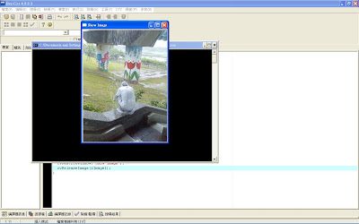
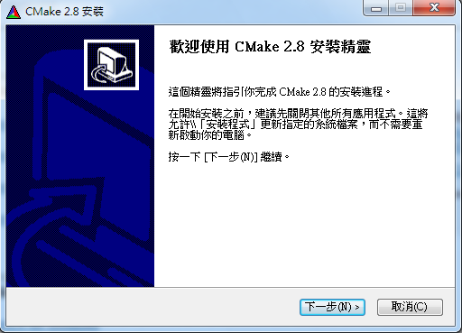
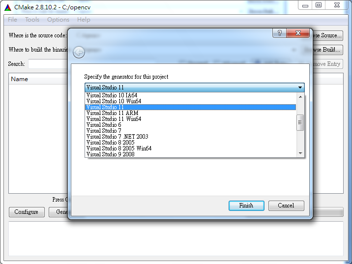
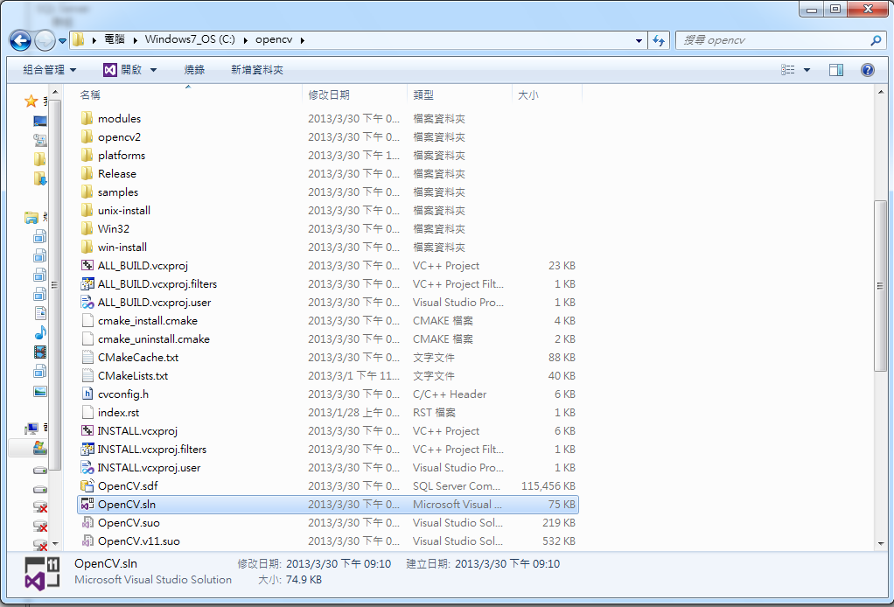

## OpenCV (1) – C 語言影像辨識函式庫 -- 簡介、安裝與基本範例 (作者：Da Wang)

OpenCV 是 Intel 所釋出的一組影像辨識函式庫，功能相當強大，從本期開始，
我們將刊載由 Da Wang 一連串的 OpenCV 系列文章，讓讀者得以透過這些文章
進入影像辨識與處理的領域，這些文章的原文網誌位於以下網址：

* <http://yester-place.blogspot.tw/search/label/OpenCV>

然而、網誌中的文章是 2008 年開始寫的，因此在使用的 OpenCV 版本上有些許落差，
為了彌補這樣的問題，編輯請 Da Wang 幫我們補充了最新的 OpenCV 2.44 版的程式示範，這個新版採用
cmake 建置軟體，可以編出 GNU make 專案或 Visual Studio 的專案，讓讀者能透過這樣的示範順利的執行
網誌中的這些程式。

### 簡介

OpenCV(Open Source Computer Vision) : 由Intel公司所開發出來的Open Source圖形演算法的函式庫(Image Process Libary)可以製做圖片，視訊，矩陣運算，統計，圖論，資料儲存的相關 C 語言程式設計，

相關的領域為:影像處理，電腦視覺，圖形識別，電腦圖學，資訊檢索或遊戲設計，比較有名的製作為物體追蹤，人臉辨識，傅立葉轉換，紋理分析，
可以整合不同圖檔格式的矩陣運算，應用在靜態圖片(BMP,JPG,TIF,PNG) ，動態Webcam的影像處理。

OpenCV 的組成為許多圖形處理的資料結構及演算法所疊合而成， 因此需要一些基本的資料結構基礎， 比如說 struct 怎麼使用，
如何 release 資料結構的空間等基本操作，會使用到 linked list 的算少數， 算是C語言中級程式設計， 有興趣玩的話，國內影像處理領域相關論文演算法幾乎都可以在OpenCV找的到，方便學術界用c語言推演更進階的影像處理演算法，
功能好比Matlab，但比Matlab快上許多倍，更可以整合c語言相關函式庫，做更多元強大的功能應用，然而它最大的門檻是比 Matlab 
的進入障礙還高一些， 運用到許多資料結構，指標運算，記憶體位址，學完OpenCV，相信程式設計的功力更可以技高一籌。

OpenCV 提供了簡單的GUI介面， 他無法像 MicroSoft Visual C++ 的 MFC 及 Borland C++builder 的 VCL 那麼完整，但如果是對於學術領域的研究是夠用的，他也可以整合在Visual C++及C++ builder的環境上， 
而本人是以Dev - C++為主， 屬於最基本簡單又不須付費的 Complier。

接下來進入 OpenCV 最基礎的入門， OpenCV 最常用的函式庫為 "cv.h"，"highgui.h"，"cxcore.h"及"cvaux.h.h"，"cv.h"代表Computer Vision， 電腦視覺函式庫， "highgui.h"， 當然就是GUI介面的函式庫啦， 當路徑都設定好之後(第一篇安裝方法)， 直接在開頭include進去就好啦，就跟stdio.h的使用方法一樣

```CPP
#include <stdio.h>
#include <cv.h>
#include <highgui.h>
#include <cxcore.h>
#include <cvaux.h>
```

### 顯示靜態圖片

接著，就介紹最基本的資料結構，IplImage，此資料結構是所有圖檔的一個中介，圖檔格式有很多種(bmp,jpg,png,tif)，此資料結構的內容既不是bmp，也不是jpg，而是一個藉由cvLoadImage()所轉換的自定義格式如下所示:


讀入圖片之後，要怎麼知道圖片真的讀入了呢，就利用"highgui.h"的功能來檢視看看吧。

```CPP
cvNamedWindow("Show Image",0); 
cvResizeWindow("Show Image",300,400); 
cvShowImage("Show Image",Image1);
```

要使用 OpenCV 的 GUI 時， 要先給視窗名稱命名， 這算是比較好寫的GUI之ㄧ了， 裡面"Show Image"就是這個視窗的名稱，cvResizeWindow()就是調整視窗大小，視窗大小被設定在300*400，並指定視窗的名稱，再來，就是顯示視窗的圖片cvShowImage()，並且給予IplImage資料結構的結構變數，Image1裡面必須要先用cvLoadImage()存入圖檔，接著，再用鍵盤事件cvWaitKey(0)來做阻斷，一張圖片就可以被開啟啦，這是OpenCV最基本的操作之ㄧ，也像是c語言的"hello world"的開始，恭喜跨入第一步。

當資料結構被創立之後，當然要做回收的動作啦，在這邊IplImage的資料結構被創立，視窗介面的資料結構也被創立，當執行完就要做回收的動作啦，所有的資料結構都會被malloc()的副程式配置空間，而cvLoadImage()只是把一連串的動作隱藏起來，cvLoadImage()不但做了配置IplImage的資料結構空間，也把所有副檔名格式的資料初始化，將所有的數值及一些簡單的分析都存在IplImage的資料結構內，方便做一些圖形演算法的運算，而視窗介面被cvNamedWindow()給創立，視窗的資料結構被隱含在cvNamedWindow()中，使用者只要使用"Show Image"等命名操控就可以使用GUI視窗的控制，這是一種分層抽象的概念，比較複雜的部份被程式碼包再它的下一層，因此，我只要操控該視窗的字串名稱("Show Image")就可以做任何想要的動作了。

這邊用cvDestroyWindow()及cvReleaseImage()回收給系統，回收的東西是記憶體，一般來說，不做記憶體回收也不會影響電腦的效能太大，作業系統也會自動的做垃圾收集，把一些沒意義的記憶體做刪除，因此程式碼不多這兩行也不會有太大的影響，不過這種東西畢竟是卡記憶體的，也不能確定它是不是永久卡位(電腦關機後一定消失)，因此，養成良好的習慣是程式設計師必備的，尤其是再做一個大的應用程式的時候。

簡單的OpenCV讀取圖形檔案程式碼

```CPP
#include <stdio.h>
#include <cv.h>
#include <highgui.h> 

int main()
{
    char FileName[10]="rain.jpg";

    IplImage *Image1 = cvLoadImage(FileName,1);

    cvNamedWindow("Show Image",0);

    cvResizeWindow("Show Image",300,400);

    cvShowImage("Show Image",Image1);

    cvWaitKey(0); 

    cvDestroyWindow("Show Image");

    cvReleaseImage(&Image1);
}
```

圖片:


執行結果:



### 使用 WebCam 抓取動態影片

視訊的使用也是OpenCV的基本功能之一，它可以做連續性的影像處理，比capCreateCaptureWindow()這個函式好用多了，
capCreateCaptureWindow()在"vfw.h"裡，只能在MicroSoft的Visual C++及 Borland C++ builder 使用， Dev-C++4.9.9.2 
不提供此函式， 當然啦， OpenCV對於視訊的處理提供了比capCreateCaptureWindow()更強大的功能。

程式碼部份

```CPP
#include <cv.h>
#include <highgui.h>
#include <stdio.h>

int main()
{
    CvCapture *capture;
    IplImage *frame;
    capture =cvCaptureFromCAM(0) ;
    cvNamedWindow("Webcam"，0);
    while(true)
    {
        frame = cvQueryFrame(capture);
        cvShowImage("Webcam",frame);
        if(cvWaitKey(10)>=0)
        {
              break;
        }
    }
    cvReleaseCapture(&capture);
    cvDestroyWindow("Webcam");
}
```

裡面使用到CvCapture及IplImage兩個資料結構，CvCapture是一個Interface的資料結構，為一個資料結構的雛形，無任何的變數型別存在，由cvCaptureFromCAM(0)來選定Webcam裝置，cvCaptureFromCAM(0)的0代表自動偵測視訊裝置，如果有兩台以上的Webcam則就用連續兩個cvCaptureFromCAM(0)函式來擷取，接著，就用while(true)的無窮回圈來捕捉連續影像的圖形畫面，cvQueryFrame()則用來擷取每秒顯示出來的frame這裡由cvWaitKey(10)來控制擷取時間，每延遲10毫秒捕捉一次視訊畫面，cvWaitKey()為鍵盤事件，每超過10毫秒則會回傳-1，因此，畫面會因cvWaitKey(10)而延遲10毫秒，接著由無窮回圈來繼續播放，當鍵盤事件發生的時候則會跳出whlie的無窮回圈，接著就把CvCapture資料結構及視窗介面資料結構做記憶體的釋放。

執行結果:


### OpenCV 2.44 版的安裝與使用 (搭配 CMake 與 Visual Studio)

#### 下載並安裝 CMake , OpenCV

下載 CMAKE : <http://www.cmake.org/>


下載 OpenCV：<http://opencv.org/downloads.html>


開啟檔案選擇 `c:\`


安裝 CMAKE




#### 透過 CMAKE 建置 OpenCV 專案

開啟CMAKE選擇路徑 `c:\opencv`，點選 configure


選擇編譯器種類




如何看編譯器呢? 方法是從Visual Studio menu 上面點選說明 (我的 Visual Studio 2012 為 Visual Studio 11)


勾選Build Example，並按下Generate


Visual Studio 2012 的專案 sln 檔將會自動產生



開啟後，選取「Debug Mode 建製方案」或「Release Mode建製方案」


設定動態鏈結函式庫路徑(DLL檔) (位於「控制台->進階->環境變數」)


#### OpenCV 的 VS 2012 Vusual C++ 環境設立

開啟一個空專案test，一個source.cpp檔，選取屬性管理員


選取 Microsofr.Cpp.Win32.user 設定


設定 VC++ 目錄的

1. Include目錄
2. 程式目錄


加入以下項目

`C:\opencv\build\include`


`C:\opencv\lib\Release`


點選連結器->輸入


加入以下項目

```
opencv_core244.lib
opencv_calib3d244.lib
opencv_contrib244.lib
opencv_features2d244.lib
opencv_highgui244.lib
opencv_imgproc244.lib
```


建置方案


### 原文連結
* [OpenCV程式設計介紹(1)](http://yester-place.blogspot.tw/search/label/OpenCV%E4%BB%8B%E7%B4%B9)
* [OpenCV程式設計介紹(2)](http://yester-place.blogspot.tw/2008/06/opencv2.html)
* [OpenCV 2.44 安裝與使用:採用 cmake 與 Visual Studio (doc)](https://www.dropbox.com/s/es8lkwtlhcp1opx/opencv%20install.doc)

【本文原始作者為 Da Wang, 由陳鍾誠編輯加註後納入雜誌】

